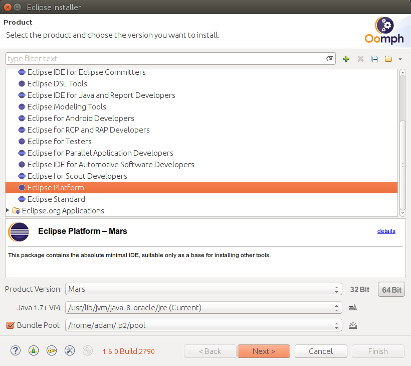

At the moment we support the following IDEs:

For the Fortran code we support Eclipse Mars (*not the current one*) with the [Photran plugin](http://www.eclipse.org/photran/).

For the C++ we haven't decided yet, but it may be either Eclipse with the CDT or QT Designer.

## Installing the Eclipse Mars with Photran 

### Eclipse installation.

Thankfully there is a cool [Eclipse Oomph Installer](https://wiki.eclipse.org/Eclipse_Installer). It requires Java, so make sure you have any version of Java installed (the OpenJDK will do: `sudo apt install openjdk-jre`)

Download the installer somewhere, extract it. 

1. Run the only executable file `eclipse-installer/eclipse-inst`: 


2. Change the installer into an advanced mode by clicking the hamburger menu on the top right


3. Select the **eclipse platform** in the installer and **Mars** Product Version with matching 32bit/64bit to your OS. Bundle pool is a place on you hard drive that caches instalation files, so they will not get downloaded again if you re-run your installer again with the same or simmilar product.   


4. Click next


5. Verify, that the `Root install folder` point somewhere where you want the software to be installed and where you have the `write` permission. I suggest not to use the home directory if you use Home directory encryption (using ecryptfs, usually set up by the Ubuntu installer), because you probably don't want the Eclipse binaries to be encrypted. Encrypted files will not get deduplicated and there might be some issues with very long filenames. I suggest designating  the `/opt/eclipse` directory for this:
```{bash}
sudo mkdir -p /opt/eclipse
sudo chown $USER:$USER +x /opt/eclipse
```  

6. Click Finish and wait a moment.


### (Optional) Installing the nice shortcut for the Eclipse.

Because we have installed the Eclipse more-or-less manually we need to handle nice icon by ourselves. 

Edit a file `~/.local/share/applications/opt_eclipse.desktop` or `/usr/share/applications/opt_eclipse.desktop` (the latter one will require super user privileges) and add the following contents:

```
[Desktop Entry]
Type=Application
Name=Eclipse
Comment=Eclipse Mars Integrated Development Environment
Icon=/opt/eclipse/ide-mars/eclipse/icon.xpm
Exec=SWT_GTK3=0 /opt/eclipse/ide-mars/eclipse/eclipse
Terminal=false
Categories=Development;IDE;Java;
StartupWMClass=Eclipse
```


### Running the eclipse

This Eclipse is rather old and it does not know how to deal with a new GTK+ 3.0 that is default on Ubuntu. We need to make sure it will fall back to the GTK+ 2.0 by setting the environment variable `SWT_GTK3` to `0`. So, you either run Eclipse by 

```
export SWT_GTK3=0; /opt/eclipse/ide-mars/eclipse/eclipse
```

or by the desktop icon created in the previous step.

### Photran installation

We have installed the Eclipse Platform, which is a bare-bones distribution of Eclipse. All functionality is to be added via a system of plugins. We install the plugins in a quite non-intuitive place, under the `Help` menu. So select the Help menu, then the `Install New Software...`


Choose the `Mars - http://download.eclipse.org/releases/mars` in the `Work with` edit box and wait a little until a list with all the available software for the Mars will get downloaded.


After a while type in `Photran` in the edit box and check the *Fortran Development Tools (Photran)* item in the tree below. Click **Next**.


Click **Next** again.


Accept the licence and click **Finish**


When the instalation finishes the Eclipse will ask you to restart. Do it.


When the Eclipse is back on, it will present you the Photran's welcome screen:


Now it is a time to tell the Eclipse to configure all views as recommended by the Photran team. Of course everything can be customized later on. Click on **Window** menu, then **Perspective**, then **Open Perspective** and **Other...**. The following window will appear:


Now Eclipse will change its face a little bit:


### Importing the Fortran code into Eclipse

Select the **File** menu, then **Import...** and in the window select **General->Existing Projects into Workspace...** and click **Next**:


Select the **Browse...** button by the *Select root directory* text box and navigate into the folder `all/mpdata-eclipse` relative to the pulled repository with our code. After that click the **Finish**


After that you will have contents of our project in the Eclipse:


Next think to do is to teach Eclipse how to debug our code and where is the executable to run. But before proceeding any further make sure you have actually built the project, and there is an executable to run and debug under `all/build/mpdata-fortran` directory.

Click **Run** and then **Run Configurations...**. 


First double-click **Fortran Local Application** item on the left hand side list to create a child item. Name this item accordingly to your needs, something like `Launch dwarf1`. You will create a separate run configuration for each executable file you will work on, so you need a way to distinguish between them.

Next choose a Fortran application to run - click the **Browse** button immidiately below the first edit box under the tab **Main** and navigate to the location of your executable:


Then you also need to specify the Fortran project with the code, otherwise Photran will not know how to build the file. Click on the **Browse** button to the left of the **Project:** edit box and select the imported Photran project:


Then click **Run** to test if it runs. The Eclipse will create the build configuration for you and build the project in its own project directory. 

Now come back to the same the dialog and change the location of the executable to the one inside the Photran's project, `all/mpdata-eclipse/dwarf` in case of our example. Otherwise you will build one file, but debug another. 

That's it! Now you can run, debug, and edit the Fortran code inside the Eclispe IDE.
